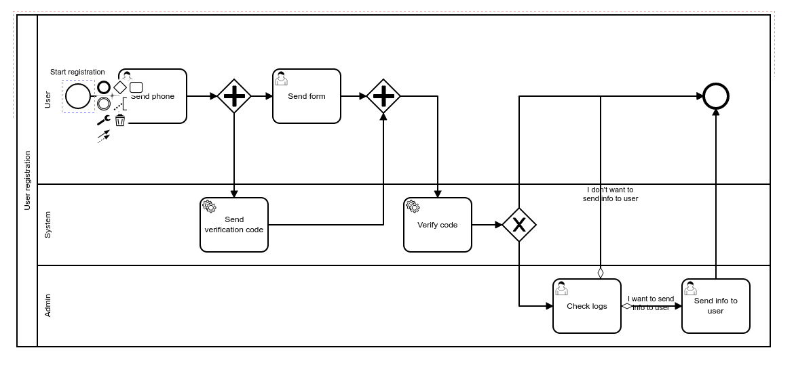
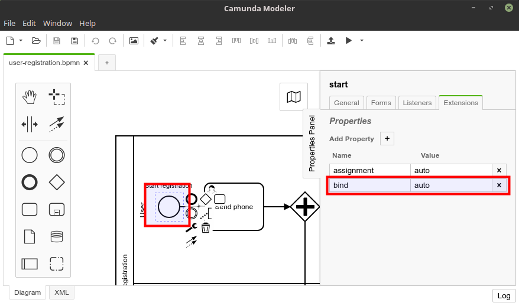
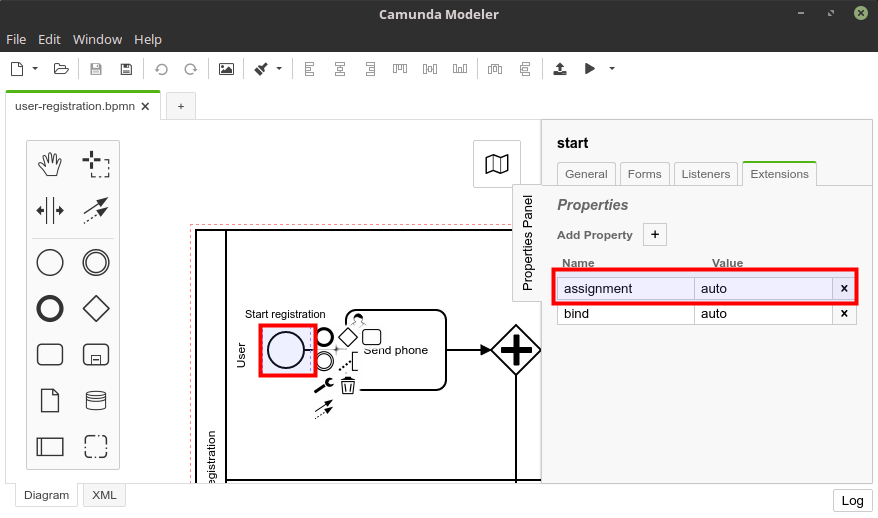

# Camunda process example with Micronaut

This project is a simple example of [Camunda](https://camunda.com/) process deployed and run in [Micronaut](https://micronaut.io/) environment using [micronaut-camunda-bpm](https://github.com/NovatecConsulting/micronaut-camunda-bpm). I wanted to see here how both technologies cooperate with each other (well) and if Camunda is also such a crude technology like [Activiti](https://www.activiti.org/) in which it is very hard to accomplish anything what original creators didn't have on mind (it is, but the modeler is better :)).

Here is the hypothetical user process registration I've been working on:

  

The process definition is [here](src/main/resources/user-registration.bpmn) and is editable using [Camunda Modeler](https://camunda.com/download/modeler/). Please check [this test](src/test/java/camunda/example/UserRegistrationProcessTest.java) to see how the process works. 

## Process model

One of things I wanted to extend the original concept with is storing process variables in a model object, not in raw properties from which you always have to get values using unhandy `(MyType) execution.getVariable("variableName")`. This is not easily achievable, because while you can bind these properties with expression language, the task form data as well as service task result variable doesn't support it.

However, I've finally achieved what I wanted using [this piece of code](https://github.com/l0co/camunda-micronaut-example/blob/49e6633cb9487850847773678935b5e18e10acbc/src/main/java/camunda/example/BaseProcessHandler.java#L51-L74) which rebinds raw process variables into an object model. This method is called automatically after ending user and service task if `bind = auto` extension property is detected on a start task (unfortunately not with a process definition extension because of Camunda crudeness):



Now, instead of getting variables from raw maps, inside a process handler I can access them with a model object:

```java
public void systemSendVerificationCode(UserRegistration model) {
    doSend(model.getCode());
}
```   

## Auto lane assignment

Surpisingly in Camunda there's no lane auto assignment, i.e. in the example process there are two tasks assigned to admin user: *Check logs* and *Send info to user*. When the first task is executed, one of admin users need to **claim** this task, but for my usecase (and naturally) when a specific user enters into a lane, it should get automatically other tasks related to this lane. Unfortunately there's no corresponding feature in Camunda and the second task (and all other tasks) needs to be claimed again, potentially by other admins.

My extension supports automatic lane assignment using [this part of code](https://github.com/l0co/camunda-micronaut-example/blob/49e6633cb9487850847773678935b5e18e10acbc/src/main/java/camunda/example/ProcessService.java#L76-L116). To enable it `assignment = auto` extension property has to be set on a start task:
 

